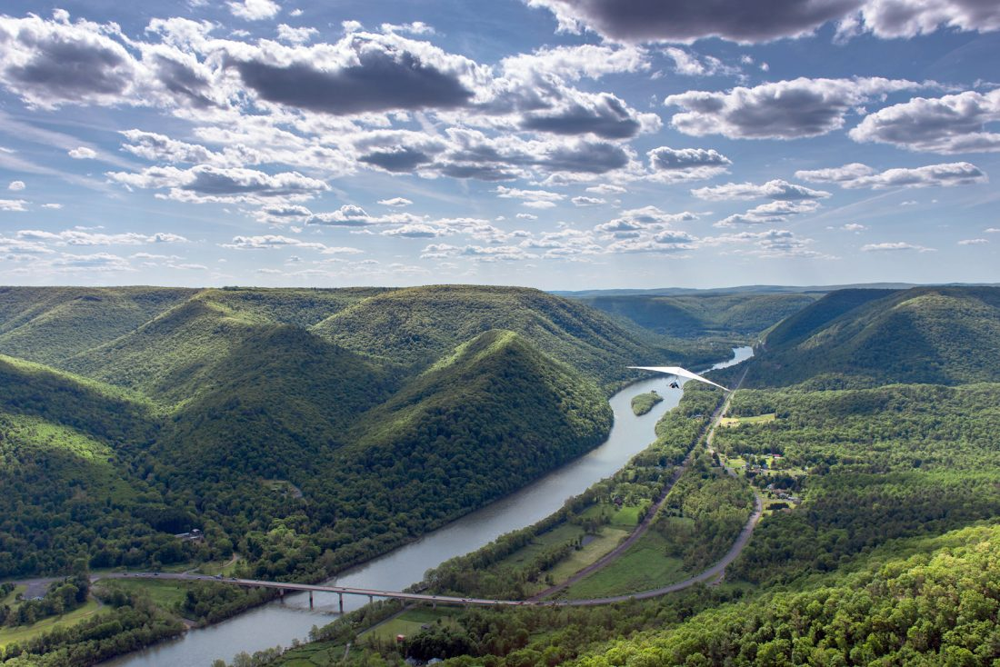
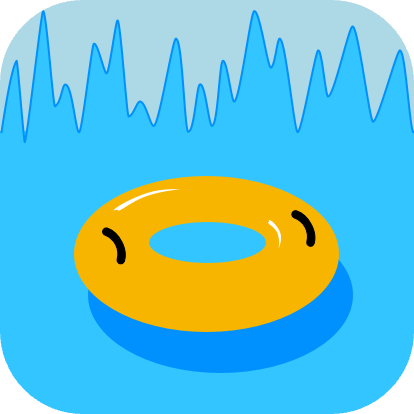

[](https://www.python.org/)
[](https://www.djangoproject.com/)
[](https://plotly.com/)
[](https://pandas.pydata.org/)
[](mailto:scott.grivner@gmail.com)
[](https://www.buymeacoffee.com/scottgriv)

-------

# River Charts
- River Charts is a `python`, `django`, `plotly`, and `pandas` web application that visualizes river data.
- The line graph is driven by data pulled using an `API` from the [United States Geological Survey (USGS)](https://www.usgs.gov/).

<div align="center">
  
  
</div>

# Background
Every year, my friends and I float down the **Susquehanna River** in **NEPA** on river tubes. I wanted to create a web application that would allow us to visualize past river data, allowing us to see the river height on the days we floated. Some float dates, we still got together, but we didn't float due to the dangerous river levels. 
<span style="color:green"><b>Green</b></span> plots on the graph represent the dates we did float, and 
<span style="color:red"><b>Red</b></span> plots represent the dates we did not float.

<div align="center">
    <a href="https://pawilds.com/journey/west-branch-susquehanna" target="_blank">
        
    </a>
    <br>
    <span style="color:gray; font-style:italic;">West Branch, Susquehanna River</span>
</div>

## API Output Example
The application sources data using an `API` that returns `JSON` output. Here's an example of what the API response looks like:

```json
{
    "name": "ns1:timeSeriesResponseType",
    ...
    "timeSeries": [
        {
            "sourceInfo": {
                "siteName": "Susquehanna River at Meshoppen, PA",
                ...
            },
            "variable": {
                "variableName": "Gage height, ft",
                ...
            },
            "values": [
                {
                    "value": [
                        {
                            "value": "15.13",
                            "dateTime": "2015-07-01T00:00:00.000-04:00"
                        },
                        ...
                    ]
                }
            ]
        }
    ]
}
```
(For the sake of brevity, the full output is abbreviated with `...`)

## Calling the API
To call the `API` and retrieve the data:

1. Make a GET request to: `http://nwis.waterservices.usgs.gov/nwis/...` (based on your requirements).
    - ex. `https://waterservices.usgs.gov/nwis/iv?format=json&sites=01533400&startDT=2015-07-01&endDT=2023-08-16&parameterCd=00065&siteStatus=active&siteType=ST`
2. Pass the necessary parameters in the request.
    - ex.
    ```python
    params = {
        "format": "json", # Set your interchange format.
        "sites": "01533400", # Site Code: Susquehanna River at Meshoppen, PA.
        "startDT": "2015-07-01", # Set the date you want to start collecting data from.
        "endDT": "2023-09-14", # This is based on the current date in the application.
        "parameterCd": "00065", # Parameter Code: Gage height, ft.
        "siteStatus": "active", # Selects sites based on whether or not they are currently active. Each USGS Water Science Center determines whether a site is active or inactive. The default is all (show both active and inactive sites).
        "siteType": "ST", # ST = A body of running water moving under gravity flow in a defined channel. The channel may be entirely natural, or altered by engineering practices through straightening, dredging, and (or) lining. An entirely artificial channel should be qualified with the "canal" or "ditch" secondary site type.
    }
    ```
    - [Codes and Parameters](https://help.waterdata.usgs.gov/codes-and-parameters)
    - [USGS Site Web Service](https://waterservices.usgs.gov/rest/Site-Service.html)
        - [Format](https://waterservices.usgs.gov/rest/Site-Service.html#format)
        - [Sites](https://waterservices.usgs.gov/rest/Site-Service.html#sites)
            -[Site Example](https://waterdata.usgs.gov/monitoring-location/01533400/#parameterCode=00065&period=P7D&showMedian=true)
        - [Parameter Codes](https://waterservices.usgs.gov/rest/Site-Service.html#parameterCd)
            -[List of Parameter Codes](https://help.waterdata.usgs.gov/parameter_cd?group_cd=PHY)
        - [Site Status](https://waterservices.usgs.gov/rest/Site-Service.html#siteStatus)
        - [Site Type](https://waterservices.usgs.gov/rest/Site-Service.html#siteType)
            - [List of valid Site Types](http://help.waterdata.usgs.gov/site_tp_cd)
3. Process the JSON response as demonstrated in the example above.

**Notes:** 
- The `API` is rate limited to 30 calls per minute. If you exceed this limit, you will receive a `429` error.
- Errors are handled in the application by redirecting the user to an error page.

## Local Installation and Running
To install and run the project locally, follow the steps below:

1. Clone the repository:
   ```bash
   git clone https://github.com/scottgriv/River-Charts
   ```

2. Navigate to the project directory:
   ```bash
   cd [YOUR PROJECT DIRECTORY]
   ```

3. Create a virtual environment:
   ```bash
   python -m venv venv
   ```
    - [Creating Virtual Environments](https://docs.python.org/3/tutorial/venv.html)

4. Activate the virtual environment:
   ```bash
   source venv/bin/activate
   ```
    - [Activating a virtual environment](https://docs.python.org/3/tutorial/venv.html#creating-virtual-environments)

5. Install the required packages:
   ```bash
   pip install django pandas plotly requests python-decouple
   ```

6. Run the Django server:
   ```bash
   python manage.py runserver
   ```

7. Edit `config.py` to add your own USGS `API` (and other) information.
    - [USGS API](https://waterservices.usgs.gov/rest/IV-Service.html)
    - [USGS API Documentation](https://help.waterdata.usgs.gov/faq/automated-retrievals)

8. Toggle `USE_DUMMY_DATA` to `True` in `config.py` to use dummy data instead of the `API`.
    - This is useful for testing the application without making `API` calls.

Now, you can visit `http://127.0.0.1:8000/` in your browser to access the application.

## Dependencies
This project makes use of several libraries and frameworks:
- **Django:** For web application functionality.
- **Plotly:** For creating interactive visualizations.
- **Pandas:** For data manipulation and analysis.

## Disclaimer
The data provided by this application is sourced from the [USGS](https://www.usgs.gov/). It's subject to revision, and for more information, please refer to their [official disclaimer](http://waterdata.usgs.gov/nwis/help/?provisional).

## License
- **River Charts** is released under the terms of the **GNU General Public License, version 3 (GPLv3)**. The GPLv3 is a "copyleft" license, ensuring that derivatives of the software remain open source and under the GPL.
- For more details and to understand all requirements and conditions, see the [LICENSE](LICENSE) file in this repository.

## Credit
**Author:** Scott Grivner <br>
**Email:** scott.grivner@gmail.com <br>
**Website:** [scottgrivner.dev](https://www.scottgrivner.dev) <br>
**Reference:** [Main Branch](https://github.com/scottgriv/River-Charts) <br>
<div align="center">
    <a href="https://github.com/scottgriv/River-Charts" target="_blank">
        
    </a>
</div>
