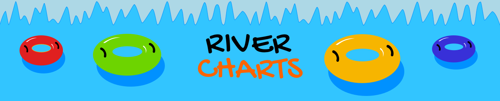
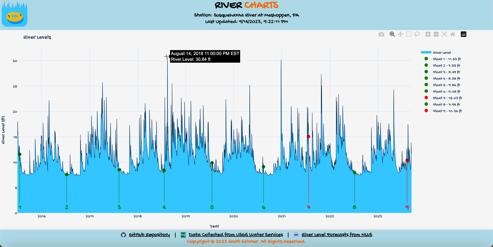
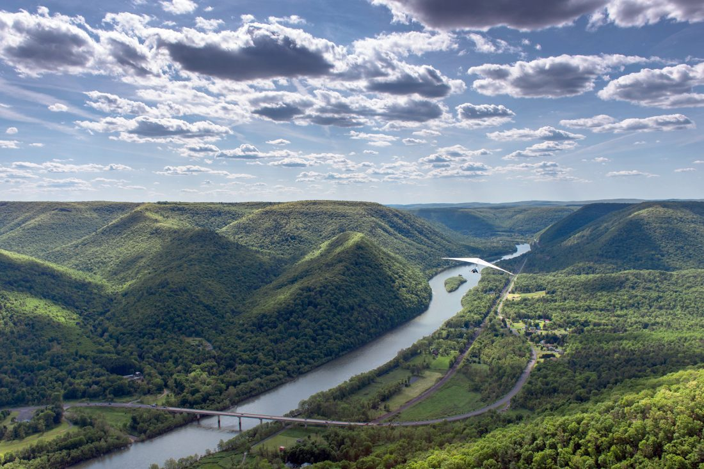
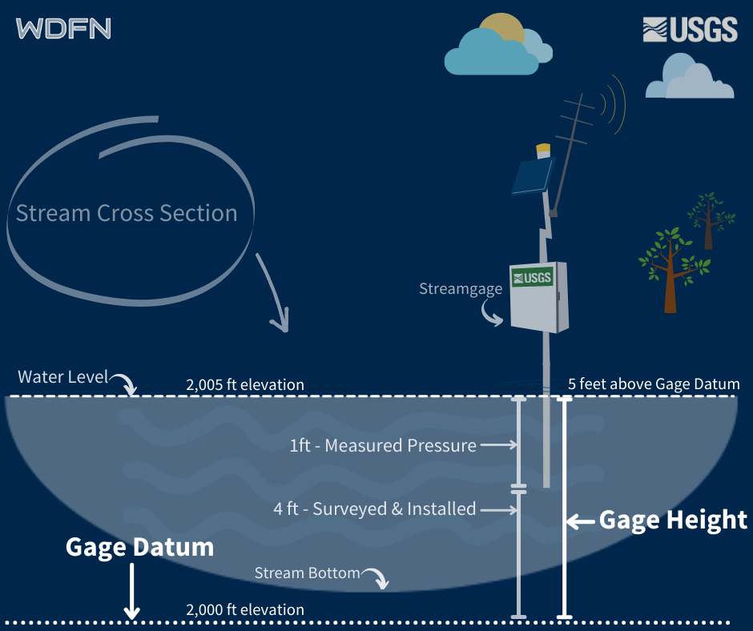
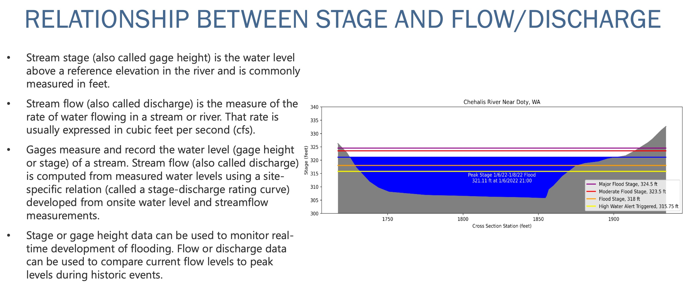
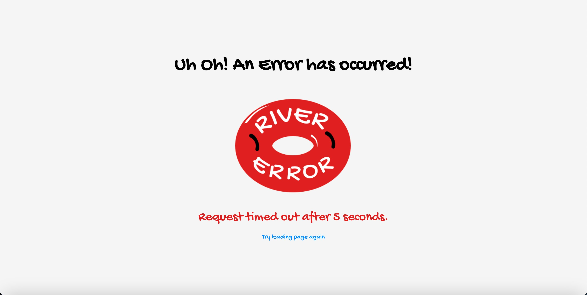
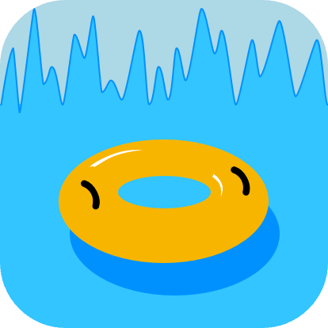

<!-- Begin README -->

[](https://scottgriv.pythonanywhere.com/)

<p align="center">
    <a href="https://www.python.org/"></a>
    <a href="https://www.djangoproject.com/"></a>
    <a href="https://plotly.com/"></a>
    <a href="https://pandas.pydata.org/"></a>
    <br>
    <a href="https://github.com/scottgriv"></a>
    <a href="mailto:scott.grivner@gmail.com"></a>
    <a href="https://www.buymeacoffee.com/scottgriv"></a>
    <br>
    <a href="https://prgportfolio.com"></a>
</p>

---------------

<h1 align="center">🌊 River Charts 📈📉</h1>

**River Charts** is a `Python`, `Django`, `Plotly`, and `Pandas` web application that visualizes river data for a specific river/site/location.
- The line graph is driven by data pulled using an `API` from the [United States Geological Survey (USGS)](https://www.usgs.gov/).
    - The data is captured by the **USGS** using a [gage height](#gage-height) sensor every 15 minutes.
- The data is updated with the most recent river height data every time the application is loaded.
    - Please be patient, the loading time of the application is around 30+ seconds (depending on your internet connection), due to the large `API` `JSON` response and the amount of data being processed from the USGS.
    - The application can be configured to pull live data in via the `API` or use a static `.json` file to display a snapshot of data.
- The loading screen screen contains fun wave and tube graphics as well as 20 "Fun Facts" regarding Tubing and Rivers on a 7 second interval to keep the user occupied while the data is loading in the background. 
- I recommend using the application on a desktop since the chart is interactive has a wider view, but it can be used on a mobile device as well.
- Visit the application [here](https://scottgriv.pythonanywhere.com/).

<div align="center">
  
  
</div>

---------------

## Table of Contents

- [Features](#features)
- [Background Story](#background-story)
- [Definitions](#definitions)
- [Getting Started](#getting-started)
    - [Dependencies](#dependencies)
    - [Configuration](#configuration)
    - [Running Locally](#running-locally)
    - [Deployment](#deployment)
- [What's Inside?](#whats-inside)
- [API Documentation](#api-documentation)
    - [Calling the API](#calling-the-api)
    - [API Output Example](#api-output-example)
- [Disclaimer](#disclaimer)
- [What's Next?](#whats-next)
- [Project](#project)
- [Contributing](#contributing)
- [Resources](#resources)
    - [Technical Resources](#technical-resources)
    - [Educational Resources](#educational-resources)
- [License](#license)
- [Credit](#credit)

## Features

- [x] **Responsive:** The application is responsive and can be used on a mobile device.
- [x] **Interactive:** The application uses `Plotly` to create an interactive line graph.
- [x] **Data Visualization:** The application visualizes river data for a specific river/site/location.
- [x] **Data Source:** The application sources data using an `API` that returns `JSON` output.
- [x] **Data Processing:** The application processes the `JSON` output and converts it to a `Pandas` `DataFrame`.
- [x] **Data Manipulation:** The application manipulates the `DataFrame` to create a `Plotly` line graph.
- [x] **Data Update:** The application updates the data with the most recent river height data every time the application is loaded.
- [x] **Data Capture:** The data is captured by the USGS using a [gage height](#gage-height) sensor every 15 minutes.

## Background Story

Every year, my friends and I float 2 miles down the **Susquehanna River** in **NEPA** on river tubes (a 2 hour float). I wanted to create a web application that would allow us to visualize past river data in order to see the river height on the days we floated down the river. Some float dates, we still got together, but we didn't float due to the dangerous river levels. 

Below is the key to use when viewing the plots on the graph for Float dates:

| Color         | Hex                                                                | Floated Status                          | Floated Key |
| ------------- | ------------------------------------------------------------------ | --------------------------------------- | ----------- |
| Green         |  `#008000` | Yes (Met up and did Float)              | Y           |
| Red           |  `#FF0000` | No (Met up, but did not Float)          | N           |
| Orange        |  `#FFA500` | Skipped (Skipped the event altogether)  | S           |


> [!NOTE]
> The closest river gage to our float location is the [Susquehanna River at Meshoppen, PA](https://waterdata.usgs.gov/nwis/uv?01533400), which is the default site code in the application. 
> You can change the site code in the application `config.py` file to visualize data for a different river/site code.

<div align="center">
    <a href="https://pawilds.com/journey/west-branch-susquehanna" target="_blank">
        
    </a>
    <br>
    <i>West Branch, Susquehanna River.</i>
</div>

<div align="center">
    <a href="https://waterdata.usgs.gov/blog/gage_height/" target="_blank">
        
    </a>
    <br>
    <a href="https://www.usgs.gov/media/images/usgs-stage-discharge-relation-example" target="_blank">
        
    </a>
    <br>
    <i>The application uses gage height data to plot the river height in feet on a given date.</i>
</div>

## Definitions

Here are some definitions to help you understand the terminology used in this document:

- <ins><b>USGS</b></ins>: The United States Geological Survey. The USGS is a science organization that provides impartial information on the health of our ecosystems and environment, the natural hazards that threaten us, the natural resources we rely on, the impacts of climate and land-use change, and the core science systems that help us provide timely, relevant, and useable information.
    - [USGS](https://www.usgs.gov/)
- <ins><b>Gage Height</b></ins>: The height of the water surface above the gage datum (zero point). Gage height is often used interchangeably with the more general term, stage, although gage height is more appropriate when used with a gage reading. Stage is more appropriate when used with a recorded or calculated gage height.
    - [Gage Height](https://waterdata.usgs.gov/blog/gage_height/)
    - [Why does the USGS use the spelling "gage" instead of "gauge"?](https://www.usgs.gov/faqs/why-does-usgs-use-spelling-gage-instead-gauge#:~:text=Newell%20is%20purported%20to%20be,influence%20added%20a%20'u')

## Getting Started

### Dependencies

This project makes use of several libraries and frameworks:
- **Python:** For the application logic.
- **Django:** For web application functionality.
- **Plotly:** For creating interactive visualizations.
- **Pandas:** For data manipulation and analysis.
- **Requests:** For making `API` calls.
- **Python-Decouple:** For storing sensitive information in a `.env` file.
- *See [requirements.txt](requirements.txt) for a full list of dependencies.*

### Configuration

- Edit `config.py` to add your own USGS `API` (and other) information.
    - [USGS API](https://waterservices.usgs.gov/rest/IV-Service.html)
    - [USGS API Documentation](https://help.waterdata.usgs.gov/faq/automated-retrievals)
- Toggle `USE_DUMMY_DATA` to `True` in `config.py` to use dummy data instead of the `API`.
    - This is useful for testing the application without making `API` calls.
- Toggle `USE_SNAPSHOT_DATA` to `True` in `config.py` to use snapshot/static data instead of the `API`.
    - This is useful for avoiding `API` calls and using a static data set in the `data/snapshot.json` file.
    - You will need to populate the file with `JSON` by calling the "Historical River Levels" `API` call in `Postman`, included in this project (`docs/api/River Charts.postman_collection.json`); see [Calling the API](#calling-the-api) below for more information.
    - Your app will esentially be a snapshot, and not live updates using this method, but it can be helpful if you want to avoid server costs making `API` calls.
- The float data plots are driven from a `.csv` file located in `static/data/river_charts.csv`.
    - This file can be edited to add/remove float dates.
    - The file is read in `views.py` and passed to the template as a `context` variable.

### Installation

To install and run the project locally, follow the steps below:

1. Clone the repository:
   ```bash
   git clone https://github.com/scottgriv/River-Charts
   ```
    - [Cloning a repository](https://docs.github.com/en/repositories/creating-and-managing-repositories/cloning-a-repository)

2. Navigate to the project directory:
   ```bash
   cd [YOUR PROJECT DIRECTORY]
   ```

3. Create a virtual environment:
   ```bash
   python -m venv venv
   ```
    - [Creating Virtual Environments](https://docs.python.org/3/tutorial/venv.html)

4. Activate the virtual environment:
   ```bash
   source venv/bin/activate
   ```
    - [Activating a virtual environment](https://docs.python.org/3/tutorial/venv.html#creating-virtual-environments)

5. Install the required packages using `requirements.txt`:
   ```bash
   pip install -r requirements.txt
   ```
    - [Installing Packages](https://packaging.python.org/tutorials/installing-packages/)

    **Note:** If you wany to generate a new `requirements.txt` file, run the following command:
    ```bash
    pip freeze > requirements.txt
    ```
    - [Requirements Files](https://pip.pypa.io/en/stable/user_guide/#requirements-files)

6. Run the Django server:
   ```bash
   python manage.py runserver
   ```
    - [Running the Django server](https://docs.djangoproject.com/en/3.2/intro/tutorial01/#the-development-server)

Now, you can visit `http://127.0.0.1:8000/` in your browser to access the application.

### Deployment

- The application is hosted [here](https://scottgriv.pythonanywhere.com/) on [PythonAnywhere](https://www.pythonanywhere.com/).
- The application is deployed using a `WSGI` configuration file.
    - [WSGI Configuration](https://docs.djangoproject.com/en/3.2/howto/deployment/wsgi/)
- First, make sure you adjust your `settings.py` file `ALLOWED_HOSTS` to include your deployment host.
    - [Deploying Django](https://docs.djangoproject.com/en/3.2/howto/deployment/)
- Second, make sure you adjust your `settings.py` file `DEBUG` to `False` for production.
    - [Django Settings](https://docs.djangoproject.com/en/3.2/ref/settings/)
- Finnaly, be sure to create a `.env` file where you host your application to store your sensitive information (excluded from this repository).
    - [Python-Decouple](https://pypi.org/project/python-decouple/)

## What's Inside?

Below is a list of the main files and folders in this repository and their specific purposes:
```bash
River-Charts # Root folder
├─ .github # GitHub related files such as CHANGELOG, CREDITS, etc.
├─ docs # Included resources.
│   ├─ api # API resources.
│   │   └─ River Charts.postman_collection.json # A Postman Collection used to manually call the API, and to gather data if you want to use this as a static site.
│   ├─ assets # Misc. resources.
│   │   └─ stage versus flow slide.pdf # A PDF file that explains stage vs. flow slide.
│   └─ images # Image resources.
├─ River_Charts # The Django project directory.
│   ├─ __init__.py # An empty file that tells Python that this directory should be considered a Python package.
│   ├─ asgi.py # An entry-point for ASGI-compatible web servers to serve your project.
│   ├─ settings.py # Settings/configuration for this Django project.
│   ├─ urls.py # The URL declarations for this Django project.
│   └─ wsgi.py # An entry-point for WSGI-compatible web servers to serve your project.
├─ rivercharts # A directory for the rivercharts app.
│   ├─ templates # A directory for HTML templates.
│   │    ├─ rivercharts # A directory for HTML templates specific to the river_charts app.
│   │    ├─ error.html # An HTML template that displays an error message.
│   │    └─ index.html # An HTML template that displays the application.
│   ├─ __init__.py # An empty file that tells Python that this directory should be considered a Python package.
│   ├─ admin.py # A file that registers models to be displayed in the Django admin site.
│   ├─ apps.py # A file that contains the application configuration.
│   ├─ config.py # A file that contains sensitive information (excluded from this repository).
│   ├─ models.py # A file that contains the database models.
│   ├─ tests.py # A file that contains the tests for the application.
│   ├─ urls.py # A file that contains the URL declarations for the application.
│   └─ views.py # A file that contains the application logic.
├─ static # A directory for static files that are used in this Django project.
│   ├─ assets # A directory images used throughout the application.
│   ├─ css # A directory for CSS files.
│   │   └─ styles.css # A CSS file that contains the styles for the application.
│   ├─ data # A directory for data files.
│   │   ├─ fun_facts.json # A JSON file used to display Fun Facts while the application is loading, add or remove more facts here.
│   │   ├─ snapshot.json # A JSON file used for static data when USE_SNAPSHOT_DATA is set to True in config.py.
│   │   └─ river_charts.csv # A CSV file that contains the float dates for the application.
│   ├─ fonts # A directory fonts used throughout the application.
│   └─ js # A directory for JavaScript files.
│       └─ script.js # The JavaScript file used to render the loading screen. 
├─ requirements.txt # A list of Python packages required to run this project.
├─ db.sqllite3 # A database file Django uses for this project (Do not delete).
├─ manage.py # A command-line utility that lets you interact with this Django project in various ways.
├─ .github # GitHub folder
├─ .gitignore # Git ignore file
├─ .gitattributes # Git attributes file
├─ PRG.md # PRG Connection File
├─ LICENSE # A file that contains the license for this project.
├─ VERSION # A file used to keep the repository release and the PythonAnywhere deployment in sync.
└─ README.md # This file.
```

## API Documentation

Below is the documentation for the `API` used in this application.

### Calling the API

To call the `API` and retrieve the data:

1. Make a `GET` request to: `http://nwis.waterservices.usgs.gov/nwis/...` (based on your requirements).
    - ex. `https://waterservices.usgs.gov/nwis/iv?format=json&sites=01533400&startDT=2015-07-01&endDT=2023-08-16&parameterCd=00065&siteStatus=active&siteType=ST`
2. Pass the necessary parameters in the request.
    - ex.
    ```python
    params = {
        "format": "json", # Set your interchange format.
        "sites": "01533400", # Site Code: Susquehanna River at Meshoppen, PA.
        "startDT": "2015-07-01", # Set the date you want to start collecting data from.
        "endDT": "2023-09-14", # This is based on the current date in the application.
        "parameterCd": "00065", # Parameter Code: Gage height, ft.
        "siteStatus": "active", # Selects sites based on whether or not they are currently active. Each USGS Water Science Center determines whether a site is active or inactive. The default is all (show both active and inactive sites).
        "siteType": "ST", # ST = A body of running water moving under gravity flow in a defined channel. The channel may be entirely natural, or altered by engineering practices through straightening, dredging, and (or) lining. An entirely artificial channel should be qualified with the "canal" or "ditch" secondary site type.
    }
    ```
    - [USGS Site Web Service](https://waterservices.usgs.gov/rest/Site-Service.html)
        - [Format](https://waterservices.usgs.gov/rest/Site-Service.html#format)
        - [Sites](https://waterservices.usgs.gov/rest/Site-Service.html#sites)
            - [Site Example](https://waterdata.usgs.gov/monitoring-location/01533400/#parameterCode=00065&period=P7D&showMedian=true)
        - [Parameter Codes](https://waterservices.usgs.gov/rest/Site-Service.html#parameterCd)
            - [List of Parameter Codes](https://help.waterdata.usgs.gov/parameter_cd?group_cd=PHY)
        - [Site Status](https://waterservices.usgs.gov/rest/Site-Service.html#siteStatus)
        - [Site Type](https://waterservices.usgs.gov/rest/Site-Service.html#siteType)
            - [List of valid Site Types](http://help.waterdata.usgs.gov/site_tp_cd)
    - [Codes and Parameters](https://help.waterdata.usgs.gov/codes-and-parameters)

3. Process the JSON response as demonstrated in the example above.

**Notes:** 
- The application uses the `API` to source data for the graph. If the `API` is down, the graph will not render.
- Errors are handled in the application by redirecting the user to an error page with the appropriate error message.
    - `HTTP` errors are handled in the application by redirecting the user to an error page with the appropriate error message.
    - The application will also display an error message if the `API` returns an empty response or a timeout error (default is set to 90 seconds in `config.py`).
    - The `API` is rate limited to 30 calls per minute. If you exceed this limit, you will receive a `429` error.
    
<div align="center">
    
    <br>
    <i>Example of an Error Page.</i>
</div>

### API Output Example

The application sources data using an `API` that returns `JSON` output. Here's an example of what the API response looks like:

```json
{
    "name": "ns1:timeSeriesResponseType",
    ...
    "timeSeries": [
        {
            "sourceInfo": {
                "siteName": "Susquehanna River at Meshoppen, PA",
                ...
            },
            "variable": {
                "variableName": "Gage height, ft",
                ...
            },
            "values": [
                {
                    "value": [
                        {
                            "value": "15.13",
                            "dateTime": "2015-07-01T00:00:00.000-04:00"
                        },
                        ...
                    ]
                }
            ]
        }
    ]
}
```
(For the sake of brevity, the full output is abbreviated with `...`)

## Disclaimer

- The data provided by this application is sourced from the [USGS](https://www.usgs.gov/). 
- It's subject to revision, and for more information, please refer to their [official disclaimer](http://waterdata.usgs.gov/nwis/help/?provisional).
- Software is provided as-is and no warranty is given about its usability. 

## Closing

Thank you for taking the time to read through this document and I hope you find it useful!
If you have any questions or suggestions, please feel free to reach out to me.
> Please reference the [SUPPORT](.github/SUPPORT.md) file in this repository for more details.

## What's Next?

I'm looking forward to seeing how this project evolves over time and how it can help others with their GitHub Portfolio.
> Please reference the [CHANGELOG](.github/CHANGELOG.md) file in this repository for more details.

## Project

Please reference the [GitHub Project](https://github.com/users/scottgriv/projects/7) tab inside this repository to get a good understanding of where I'm currently at with the overall project.
- Issues and Enhancements will also be tracked there as well.

## Contributing

Feel free to submit a pull request if you find any issues or have any suggestions on how to improve this project. You can also open an issue with the tag "bug" or "enhancement".

- How to contribute:
1. Fork the Project
2. Create your Feature Branch (`git checkout -b feature/River-Charts`)
3. Commit your Changes (`git commit -m 'Add new feature'`)
4. Push to the Branch (`git push origin feature/River-Charts`)
5. Open a Pull Request

> Please reference the [CONTRIBUTING](.github/CONTRIBUTING.md) file in this repository for more details.

## Resources

Below are some external resources I found helpful when creating **River Charts**:

### Technical Resources

- [Python](https://www.python.org/) - A programming language that lets you work quickly and integrate systems more effectively.
- [Django](https://www.djangoproject.com/) - A high-level Python Web framework that encourages rapid development and clean, pragmatic design.
- [Plotly](https://plotly.com/) - A Python graphing library that makes interactive, publication-quality graphs online.
- [Pandas](https://pandas.pydata.org/) - A fast, powerful, flexible and easy to use open source data analysis and manipulation tool.
- [Requests](https://docs.python-requests.org/en/latest/) - A simple, yet elegant HTTP library.
- [Python-Decouple](https://pypi.org/project/python-decouple/) - A Python library for separating the settings of your Django/Flask/FastAPI project from the source code.
- [Deploying Django](https://docs.djangoproject.com/en/3.2/howto/deployment/) - A tutorial on how to deploy Django.
- [Django Settings](https://docs.djangoproject.com/en/3.2/ref/settings/) - A list of all settings available in Django.
- [Running the Django server](https://docs.djangoproject.com/en/3.2/intro/tutorial01/#the-development-server) - A tutorial on how to run the Django server.
- [Creating Virtual Environments](https://docs.python.org/3/tutorial/venv.html) - A tutorial on how to create virtual environments.
- [Activating a virtual environment](https://docs.python.org/3/tutorial/venv.html#creating-virtual-environments) - A tutorial on how to activate a virtual environment.
- [Installing Packages](https://packaging.python.org/tutorials/installing-packages/) - A tutorial on how to install packages using `pip`.
- [Requirements Files](https://pip.pypa.io/en/stable/user_guide/#requirements-files) - A file containing a list of items to be installed using pip install like so: `pip install -r requirements.txt`.
- [PythonAnywhere](https://www.pythonanywhere.com/) - A Python hosting provider with a free tier.

> [!NOTE]
> To use external API's (like this application does), PythonAnywhere requires a basic paid tier.

### Educational Resources

- [USGS](https://www.usgs.gov/) - The United States Geological Survey.
- [USGS API](https://waterservices.usgs.gov/rest/IV-Service.html) - The USGS Instantaneous Values Web Service.
- [USGS API Documentation](https://help.waterdata.usgs.gov/faq/automated-retrievals) - The USGS Instantaneous Values Web Service Documentation.
- [USGS Site Web Service](https://waterservices.usgs.gov/rest/Site-Service.html) - The USGS Site Web Service.
- [Codes and Parameters](https://help.waterdata.usgs.gov/codes-and-parameters) - The USGS Codes and Parameters Documentation.
- [How to Get Real-time Flood Data from the USGS API](https://medium.com/@protobioengineering/how-to-get-real-time-river-data-from-the-usgs-api-25264da3b362) - A tutorial on how to get real-time flood data from the USGS API.
- [USGS Client Library](kapadia.github.io/usgs/) - Client library for interfacing with USGS datasets (GitHub repository).
- [USGS Client Library Repository](https://github.com/kapadia/usgs) - Client library for interfacing with USGS datasets.
- [USGS API Homepage](https://www.usgs.gov/products/web-tools/apis) - The USGS API Homepage.
- [USGS Rest API web services](https://waterservices.usgs.gov/rest/) - The USGS Rest API web services.
- [USGS Instantaneous Water Service data URL generator](https://waterservices.usgs.gov/rest/IV-Test-Tool.html) - The USGS Instantaneous Water Service data URL generator.
- [National Water Dashboard](https://dashboard.waterdata.usgs.gov/app/nwd/en/?region=lower48&aoi=default) - The National Water Dashboard.
- [Rivers vs. Streams vs. Creeks (USGS)](https://www.usgs.gov/special-topics/water-science-school/science/rivers-streams-and-creeks) - A USGS article on the difference between rivers, streams, and creeks.
- [How to Make Colored Country Maps with GeoPandas and Python](https://medium.com/@protobioengineering/how-to-make-colored-country-maps-in-python-tldr-edition-d58147105a8d) - A tutorial on how to make colored country maps with GeoPandas and Python.
- [5 Ways to Use Free Data on the Internet for Science](https://medium.com/@protobioengineering/5-ways-to-use-free-data-on-the-internet-for-science-e0661684f397) - A tutorial on how to use free data on the internet for science.
- [GitHub for Biologists](https://medium.com/@protobioengineering/github-for-biologists-407fab350083) - A tutorial on how to use GitHub for biologists. 
- [Why does the USGS use the spelling "gage" instead of "gauge"?](https://www.usgs.gov/faqs/why-does-usgs-use-spelling-gage-instead-gauge#:~:text=Newell%20is%20purported%20to%20be,influence%20added%20a%20'u') - Fun nerd fact.

## License

This project is released under the terms of the **GNU General Public License, version 3 (GNU GPLv3)**, which ensures that derivatives of the software remain open source.
- The [GNU GPLv3](https://choosealicense.com/licenses/gpl-3.0/) is a "copyleft" license, ensuring that derivatives of the software remain open source and under the GPL.
- For more details and to understand all requirements and conditions, see the [LICENSE](LICENSE) file in this repository.

## Credit

**Author:** [Scott Grivner](https://github.com/scottgriv) <br>
**Email:** [scott.grivner@gmail.com](mailto:scott.grivner@gmail.com) <br>
**Website:** [scottgrivner.dev](https://www.scottgrivner.dev) <br>
**Reference:** [Main Branch](https://github.com/scottgriv/River-Charts) <br>

---------------

<div align="center">
    <a href="https://github.com/scottgriv/River-Charts" target="_blank">
        
    </a>
</div>

<!-- End README -->
